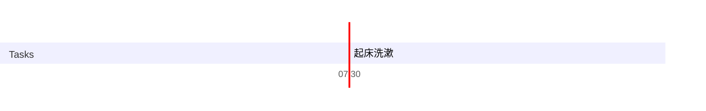

## Day Planner

```mermaid
gantt
    dateFormat  HH-mm
    axisFormat %H:%M
    %% Current Time: 10:58:56
    section Tasks
    起床洗漱     :07-30, 0mm
    section Breaks

```

- [x] 07:30 起床洗漱
- [ ] 11