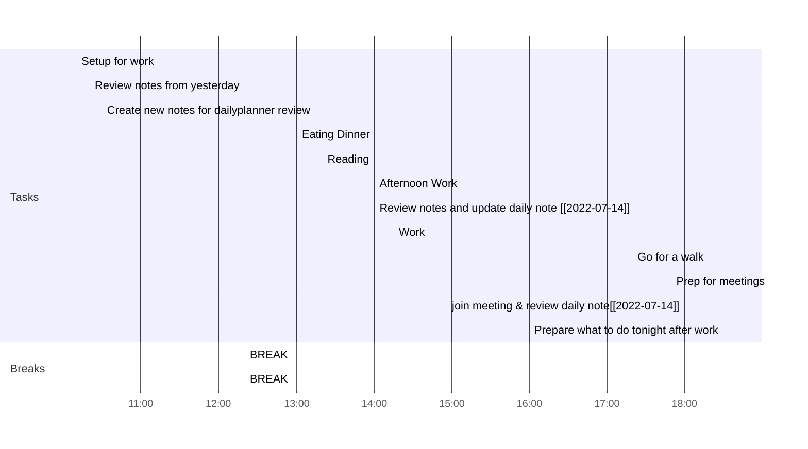

```mermaid
gantt
    dateFormat  HH-mm
    axisFormat %H:%M
    %% Current Time: 下午5:19:46
    section Tasks
    Setup for work     :10-10, 10mm
    Review notes from yesterday     :10-20, 10mm
    Create new notes for dailyplanner review     :10-30, 110mm
    Eating Dinner     :13-00, 20mm
    Reading     :13-20, 40mm
    Afternoon Work     :14-00, 0mm
    Review notes and update daily note [[2022-07-14]]     :14-00, 15mm
    Work     :14-15, 185mm
    Go for a walk     :17-20, 30mm
    Prep for meetings     :17-50, 10mm
    join meeting & review daily note[[2022-07-14]]     :18-00, 30mm
    Prepare what to do tonight after work     :18-30, 0mm
    section Breaks
    BREAK     :12-20, 0mm
    BREAK     :12-20, 40mm
```
